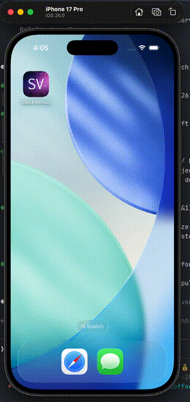

# StockVersus by Charles DiGiovanna
## CS 441 Final Project

StockVersus is an app that lets users simulate trading stocks and managing a portfolio.

It connects to the Node.coffee API that is included in the repo which connects to Yahoo Finance's stock information. The API maintains a database of its users, their portfolios, and whichever stocks are held by anyone. In addition, the user's information is maintained clientside so that the app can still function without internet connection.

By using multithreaded network requests and complex JSON parsing, the app is able to connect with the API and get the latest information upon any return to the main feed.

By updating every minute during trading hours, the API is able to hold the most up-to-date stock information and maintain an accurate balance of all its portfolios.

I didn't get around to implementing logging in (only signing up and logging out), leaderboards, or preventing non-trading-hour purchases (well, this one's really easy I just don't want to be restricted), but other than that I gotta say I'm pretty proud of this thing.